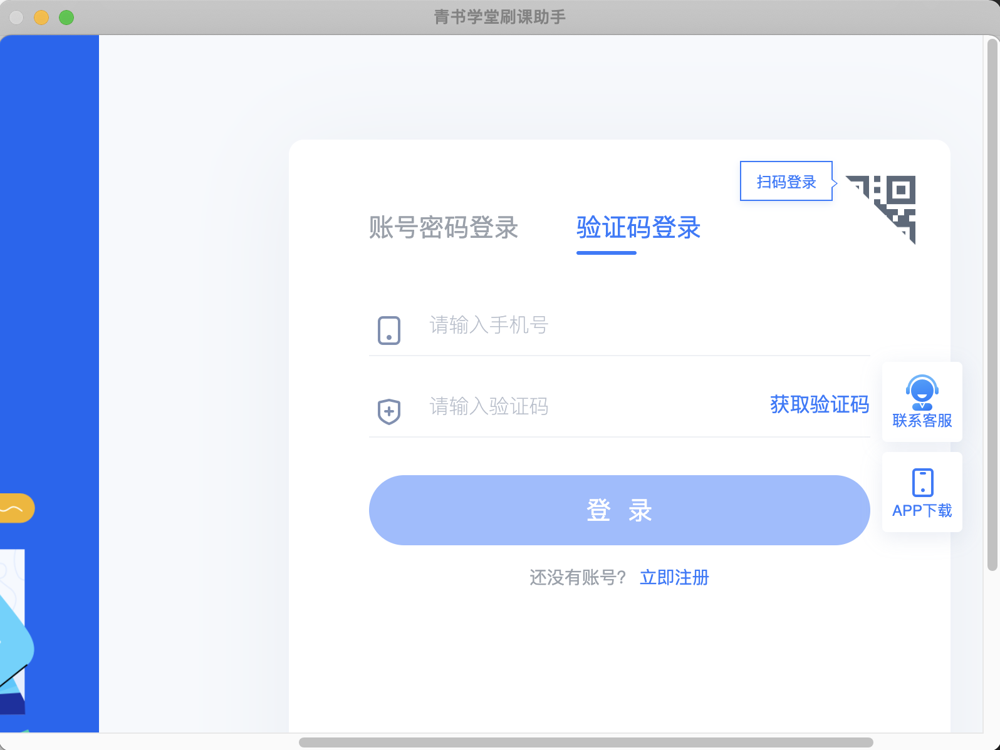
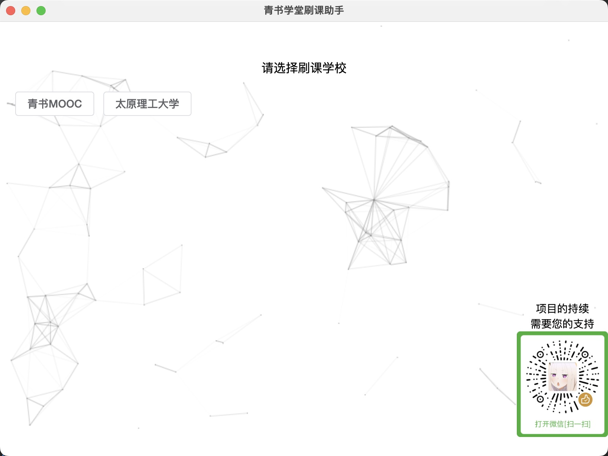
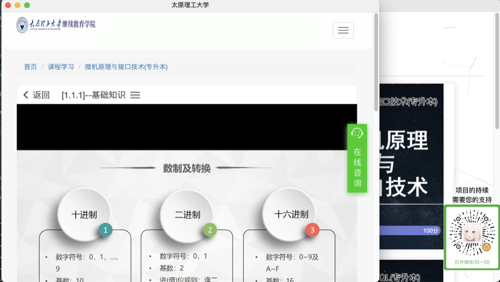

# 青书学堂助手   
一款**青书学堂**自动刷课软件  
   
支持mac, windows
   
免费, 稳定, 无广告, 操作简单, 页面简洁   
    
[下载](https://github.com/lidppp/qinshu-helper/releases/latest)
   
**注意: 千万不要在打开本软件开始刷课的同时去网页端登录, 因为我也不知道会发生什么, 但是刷课功能肯定会失效**
   
## **暂不开源**    
   
## **禁止商用,请勿滥用和私自传播**    
   
# 页面展示  
未登录  
   
   
登录页面
   
   
选择学校
   
   
首页
   
   
刷课页面
   
    

# 交流群  
QQ交流群: 573644467   
发广告直接踢, 不犹豫的那种   
   
   
# FAQ   
1. 切换账号    
   > 左上角 操作->注销账号   
   >    
   
2. 为什么会出现`未获取到课程, 请重试`弹窗   
   > 1. 请先确定课程确实有视频   
   > 2. 可能是网络环境造成课程列表并没有在第一时间刷新出来, 重试一下, 如果还是不行加交流群找群主   
   
3. 页面一直loading
   > 可能是登录信息过期了, 按照faq1的操作重新登录一下就好了
   
4. 为什么在软件内登录网页登录信息会失效
   > 因为本软件的登录信息和网页用的是同一套, 没有特殊操作的话无法实现软件内和网页一起登录   
   
   
5. 能否同时刷多个课程或者多个账号一起刷
   > 都不能, 多个课程一起刷实测视频时长不会同时涨, 只会涨最后一个打开的视频, 至于多个账号一起刷在未来也不会在本软件内开放这个功能, 本软件的初衷只为个人用户

   
--- 
更新日志   
v1.0.0   
   
> 发布第一版本   
   
v1.0.1   
   
> 1. 优化流程, 添加手动选择学校流程    
> 2. 修复个别学校课程学习页面加载错误    

v1.0.2   
   
> 1. 修改播放倍速为1
> 2. 青书学堂原网站更新, 修复刷课页面链接问题   
> 3. 新增win32安装包   
   
v1.0.3   
   
> 1. 修复青书学堂网站更新导致脚本失效      
  

v1.0.5  
  
> 1. 修复青书学堂网站更新导致程序无法按照预期逻辑运行
> 2. 添加设置倍速功能, 功能入口操作->设置
  
----
## 鸣谢
感谢您的支持   
**cheers**   

----
## 项目的持续需要您的支持
   

